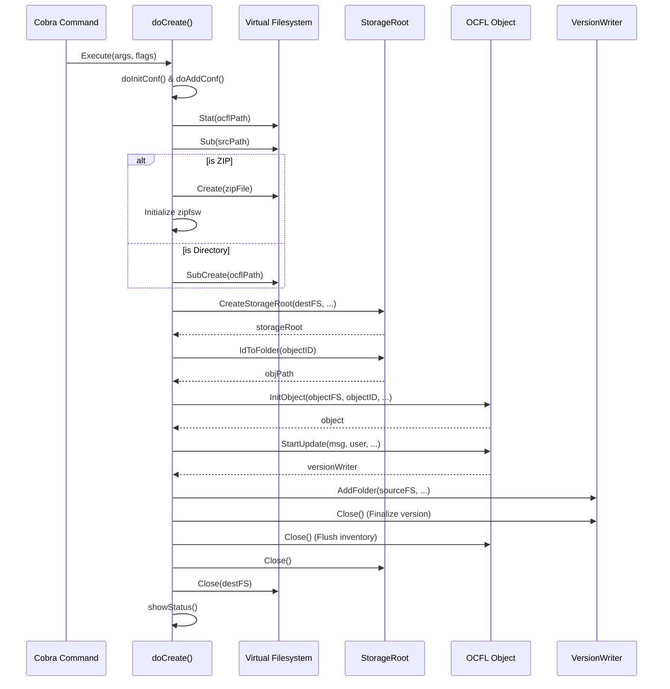
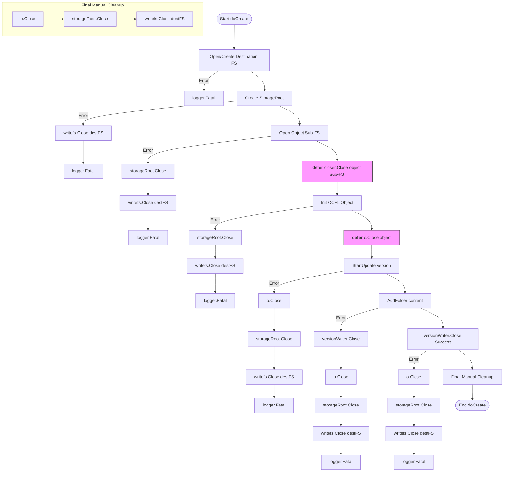

# OCFL Create Operation Documentation

This document explains the `doCreate` function in `gocfl-cli`, which is responsible for initializing a new OCFL storage root and adding an initial object with content.

## doCreate() Function Explanation

The `doCreate()` function is the core of the `create` command. It combines the functionality of `init` (initializing a storage root) and `add` (adding an object version).

### Key Steps:
1.  **Configuration**: Updates internal configurations from command-line flags (digest, message, user info, etc.).
2.  **Target Validation**: Checks if the target path exists. If it exists, it must be an empty directory (unless it's a ZIP file being created).
3.  **Filesystem Setup**:
    *   Prepares the source filesystem (where content comes from).
    *   Prepares the destination filesystem. If the target ends in `.zip`, it initializes a ZIP filesystem wrapper (`zipfsw`).
4.  **Extension Initialization**: Sets up extensions like migration, thumbnails, indexer, and metafiles.
5.  **Storage Root Creation**: Initializes the OCFL Storage Root using `CreateStorageRoot`.
6.  **Object Initialization**:
    *   Maps the Object ID to a folder path.
    *   Initializes the OCFL Object in the destination.
7.  **Version Creation**:
    *   Starts a new version update.
    *   Adds the main content folder to the version.
    *   Adds any additional "area" folders if specified.
8.  **Finalization**: Closes the version writer, the object, and the storage root to flush all data and inventories to the filesystem.

---

## doCreate Flow Sequence Diagram

---

## Resource Management: Open, Close, and Deferred

The function manages several critical resources. Because `logger.Fatal()` is used for errors (which calls `os.Exit(1)` and skips `defer`), many resources are closed manually in error blocks.

*Note: `defer` functions are registered but only execute if the function returns normally. In case of `logger.Fatal()`, the manual cleanup in each error block is executed instead.*
