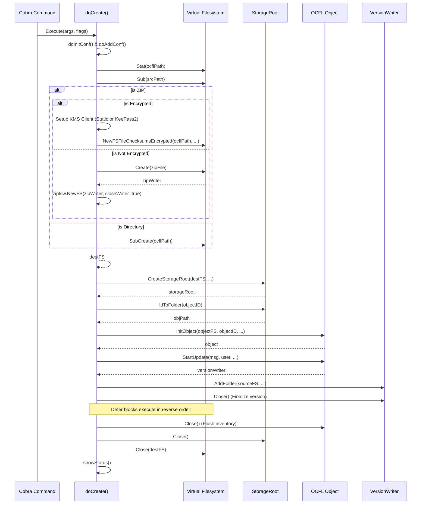
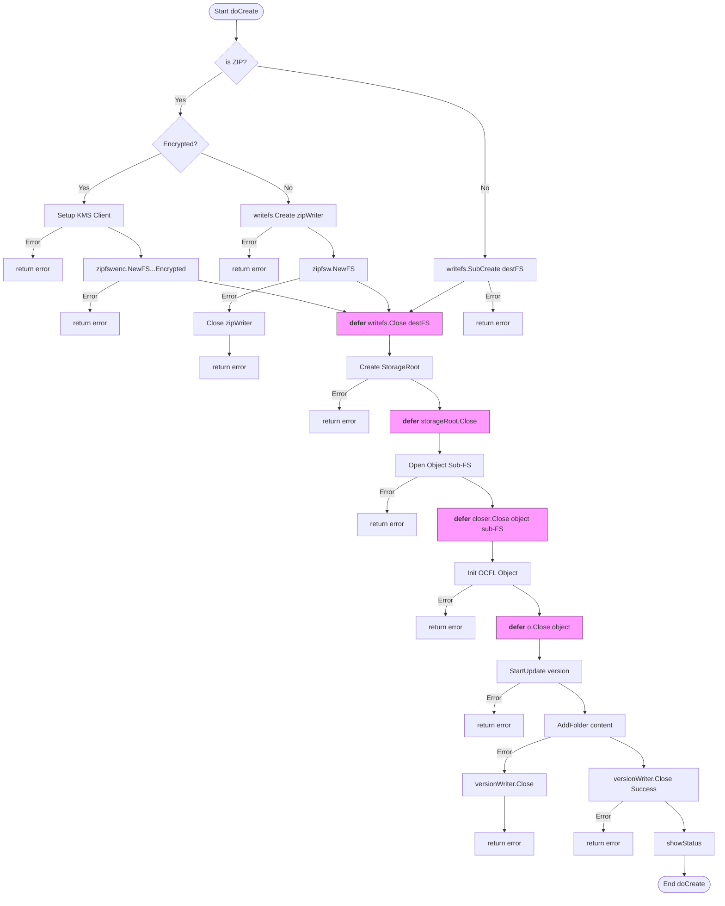

# OCFL Create Operation Documentation

This document explains the `doCreate` function in `gocfl-cli`, which is responsible for initializing a new OCFL storage root and adding an initial object with content.

## doCreate() Function Explanation

The `doCreate()` function is the core of the `create` command. It combines the functionality of `init` (initializing a storage root) and `add` (adding an object version).

### Key Steps:
1.  **Configuration**: Updates internal configurations from command-line flags (digest, message, user info, etc.). Also handles AES encryption settings if provided.
2.  **Target Validation**: Checks if the target path exists. If it exists, it must be an empty directory (unless it's a ZIP file being created).
3.  **Filesystem Setup**:
    *   Prepares the source filesystem (where content comes from).
    *   Prepares the destination filesystem.
    *   If the target ends in `.zip`:
        *   If AES encryption is enabled, it sets up a KMS client (static or KeePass2) and initializes an encrypted ZIP filesystem (`zipfswenc`).
        *   Otherwise, it initializes a standard ZIP filesystem wrapper (`zipfsw`).
4.  **Extension Initialization**: Sets up extensions like migration, thumbnails, indexer, and metafiles.
5.  **Storage Root Creation**: Initializes the OCFL Storage Root using `CreateStorageRoot`.
6.  **Object Initialization**:
    *   Maps the Object ID to a folder path.
    *   Initializes the OCFL Object in the destination.
7.  **Version Creation**:
    *   Starts a new version update.
    *   Adds the main content folder to the version.
    *   Adds any additional "area" folders if specified.
8.  **Finalization**: Closes the version writer, the object, and the storage root to flush all data and inventories to the filesystem.

---

## doCreate Flow Sequence Diagram

---

## Resource Management: Open, Close, and Deferred

The function manages several critical resources using `defer`. Since `doCreate` returns an `error` instead of calling `logger.Fatal()`, `defer` blocks are guaranteed to run when the function returns, ensuring resources are closed exactly once.

*Note: `defer` functions ensure that resources are cleaned up in the correct order (Last-In-First-Out) when the function returns, whether it's a success or an error.*
